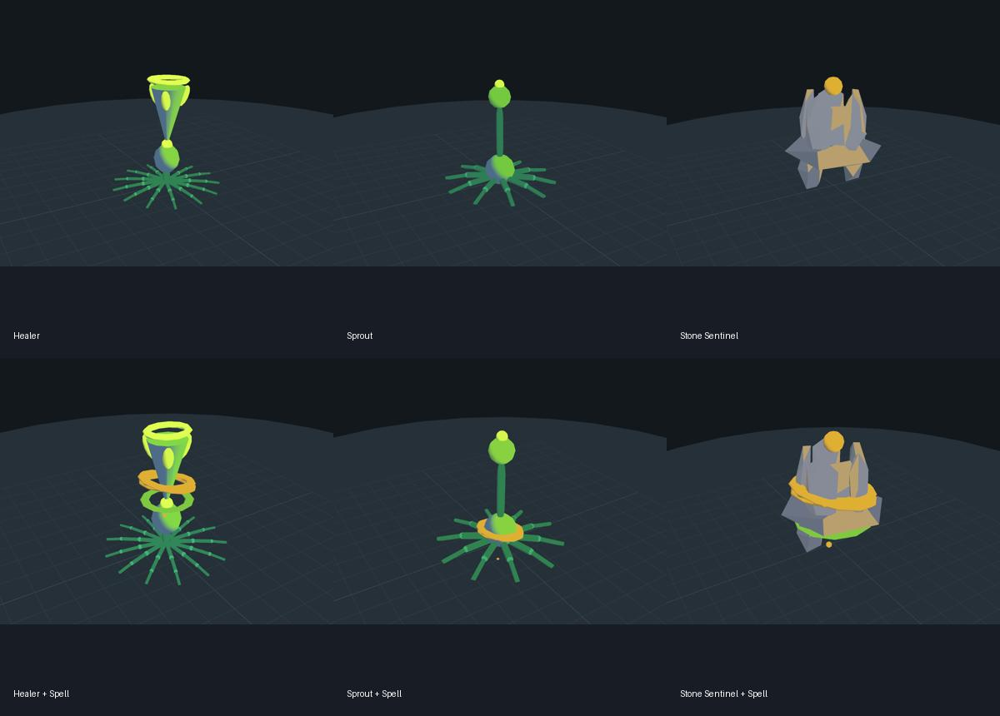
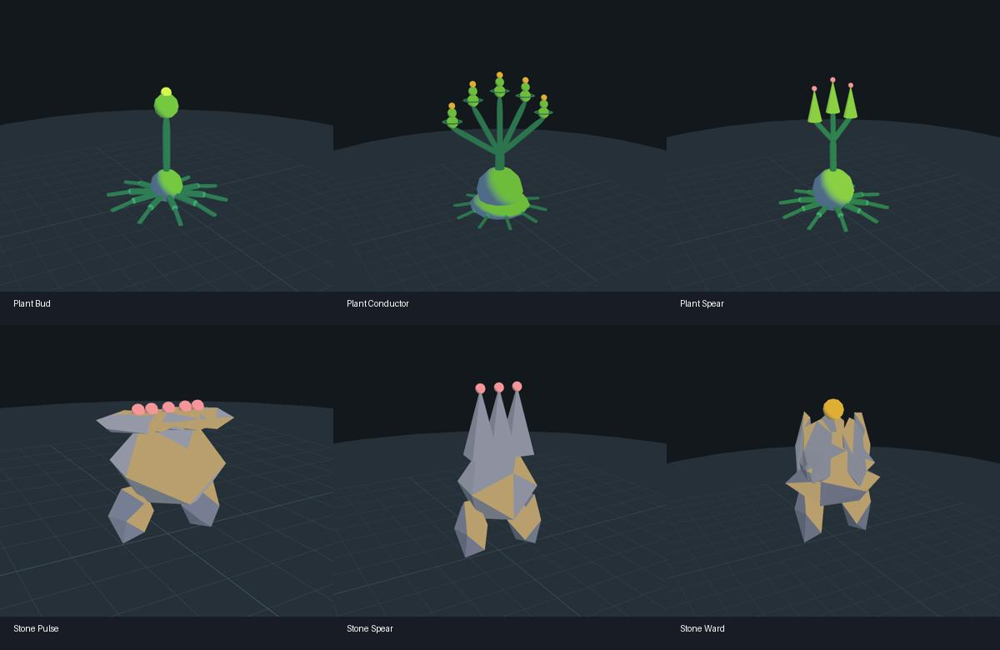

# Creature Studio

Open **Tools → Render → Render Studio** or **Tools → Render → Creature Studio**. The header switches between creature and spell authoring.

Creature Studio edits real `CreatureRecipe` assets consumed by the renderer. Its isolated 3D preview uses `CreatureRig`, baked meshes and the production plant-body/stone materials, with neutral studio lighting. No Play mode is required.



## Grammar and presets

The studio opens in **Grammar** mode. Select a saved channel preset or a local draft, then edit side, head, count, stem, mass, reach, accessory and accent. The preview recomposes through the production `LookComposer`. Six saved examples live in `Assets/Render/Creatures/Data/GrammarPresets`.

Choose a **Game entity** to inspect the channels derived by `LookDerivation`. Copy derived channels into manual controls to experiment independently. **Save as** preserves grammar inputs and vocabulary references; **Bake to editable recipe** creates an independent result in **Parts** mode.

**Vocabulary & presets** opens the actual native dictionaries: creature heads, bodies, stems, roots and accessories; creature source overrides; spell elements and handler/projectile overrides; palette and delivery vocabulary. Edits to these shared assets affect their renderer consumers. Native creature overrides take precedence in the game; the editor shows that distinction and can preview an override when its prefab exposes a recipe.

Some vocabulary settings deliberately pin reach or limit part counts. The studio explains those constraints instead of implying that every channel must change the silhouette.



## Author a creature

- Switch to **Parts**, then start with a Healer, Sprout or Stone Sentinel draft, or select an existing recipe.
- Select a part and edit its primitive, role, parent, transform, colour, glow and mesh variant. Add and duplicate parts to build a silhouette. Removing a part removes its subtree and remaps surviving parents, arm bindings and sockets.
- Tune roots, idle sway/breathing, arms, and the visual source/neck sockets. Add an arm on the selected part, then use **Rebuild rest pose** after changing segment lengths/counts; paired arm sockets are maintained by the add/remove tools. Validation explains malformed recipes instead of feeding them into the renderer.
- Play or scrub the preview; inspect health, charge and glow readouts. Orbit, pan and zoom the camera, or reset its framing.
- Save as a reusable recipe, duplicate it for a variant, or export the preview as a PNG. Undo/Redo is supported. Double-clicking a saved recipe opens the studio.

The **Preview surface** control selects plant or stone materials for a baked recipe without changing the asset. Grammar mode uses the derived side automatically.

Recipe assets affect the game only when assigned to a renderer consumer such as a CharacterView. The studio does not alter entity balance, skill logic or game scenes.

## Preview spells on your creature

In Spell Studio, use the **Creature** field beneath the timeline to choose your saved recipe. None uses the original healer. The **Edit** button opens that recipe in Creature Studio. Effects use its actual body, head and source anchors.

Saved creature examples live in `Assets/Render/Creatures/Data/StudioSamples`; the samples menu creates missing examples without replacing existing work.

## Verification

Run the EditMode filters `CreatureStudio` and `SpellStudio`. To produce visual comparisons in graphics-capable Unity batch mode:

```
-executeMethod HealerLike.Render.Creatures.Editor.Studio.CreatureStudioCapture.CaptureAll
```

Captures are written to `Logs/CreatureStudioCaptures/`.

Verified in Unity 6000.6.0f1 on macOS Metal: **1,335 passed, 0 failed, 2 skipped** across gameplay, renderer and both studio assemblies. The two skips are existing opt-in screenshot fixtures. Tests include production grammar parity, native dictionary inspectors, source derivation, grammar preset persistence, draft lifecycle and preview isolation. Six grammar-generated creature captures were visually inspected, along with the earlier creature and spell captures. Manual mouse/keyboard acceptance testing remains unavailable because Computer Use permissions were not granted. Full results: `Logs/Studio-Merge-Tests.xml`.

See [the studio audit](StudioAudit.md) for the review scope and follow-up fixes.
