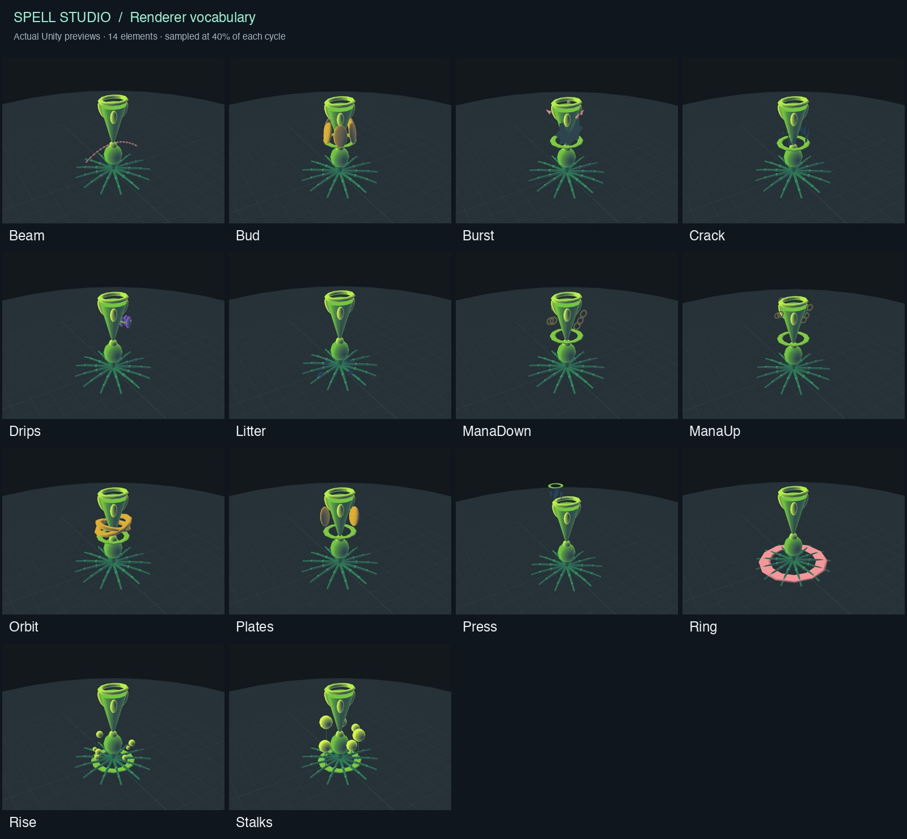

# Spell Studio

Open **Tools → Render → Spell Studio** in Unity 6000.6.0f1. No Play mode is needed. You can also double-click a saved preset or use its **Open in Spell Studio** inspector button.

The studio previews the existing `SpellEffect` renderer, its baked meshes, shader and placement rules against the healer reference. Neutral studio lighting keeps geometry and colour legible; the game stage can apply a different lighting calibration. It does not run gameplay or put preview objects in your scene.



## Create a spell look

1. Pick an element from the vocabulary library, or choose **New spell**.
2. Set the effect family, tempo, cast context and optional colour. Amount is a fraction of the target's maximum resource; 0.5 reaches the amount-based shape count limit.
3. Choose **Copy vocabulary shape into preset** to edit a private copy. Expand **Entry** to edit motion, socket, cycle duration, count rule and the shape, stack bead, critical ring and side rim arrays. Each part has a baked primitive, colour role, transform and glow.
4. Use **Play/Pause**, **Restart**, **Loop**, speed and the timeline. Scrubbing pauses playback. A periodic effect is invisible before its first period, just as in the renderer.
5. Drag the preview to orbit, scroll to zoom, Shift-drag or middle-drag to pan. **Reset view** restores the default camera. Ground and target visibility can be toggled independently.
6. Choose **Save as…** to create a reusable `.asset`. **Save** writes changes to a saved preset. **Duplicate** creates an independent draft. **Export PNG** captures the current camera and timeline position at 1600 × 1000.

**Space** toggles playback and **F** resets the camera when you are not editing text.

Use **Tools → Render → Spell Studio Samples** to create starter presets in `Assets/Render/Spells/Data/StudioSamples`. Existing sample assets are preserved.

Local drafts survive closing the window and script reloads on this machine. Save important work as a preset asset to share it or put it under source control. Use Undo/Redo for edits.

## Use an authored shape in the renderer

Saving a studio preset does not change existing gameplay spells. **Apply shape to vocabulary…** explicitly replaces the selected element in the referenced shared `EffectVocabulary`. The confirmation names the destination. All renderer consumers of that vocabulary element then use its new geometry, motion, socket and count rule. This operation supports Undo.

Preset family, custom colour, side, scale, critical state, amount and status timing are preview/cast context. They are not published into the vocabulary and do not change gameplay balance, spell targeting or buff logic.

## Validation

The preset model sanitizes invalid numeric data into safe preview values without rewriting authored data. Warnings explain missing assets, empty geometry, malformed transforms and bounds. Missing source data shows an actionable preview message.

Tests cover detached composition, persistence, all 14 effect elements, deterministic backward seeking, status timing, preview scene/material cleanup, rendered pixels, draft lifecycle and publishing. Run the EditMode test filter `SpellStudio`.

To generate visual smoke captures through Unity batch mode, execute:

```
-executeMethod HealerLike.Render.Spells.Editor.Studio.SpellStudioCapture.CaptureAll
```

Images are written to `Logs/SpellStudioCaptures/` in that Unity project. Use a graphics-capable Unity session; do not pass `-nographics` for image verification.

## Verified build

Unity 6000.6.0f1, macOS Metal, 24 September 2026: **954 passed, 0 failed, 3 skipped** across the renderer and Spell Studio EditMode assemblies. All **63 Spell Studio tests passed**. The three skipped tests are existing opt-in renderer screenshot fixtures. All 14 spell vocabulary previews were captured and visually inspected. Manual mouse/keyboard acceptance testing was unavailable because Computer Use permissions were not granted.

The complete test report is in `Logs/SpellStudio-Tests.xml`; individual preview PNGs are in `Logs/SpellStudioCaptures`.
